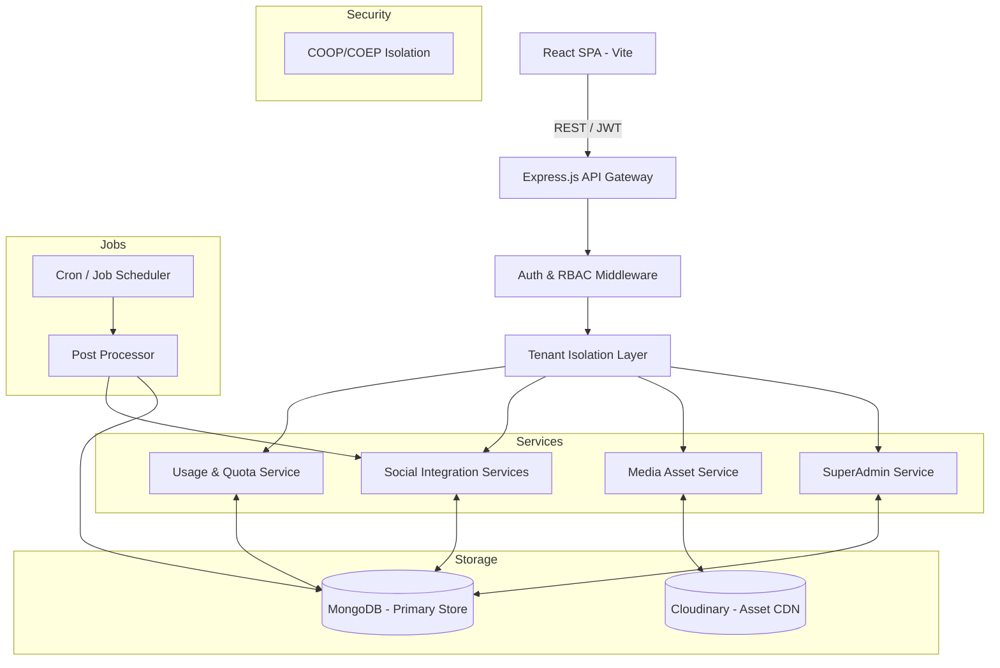

# Platform Architecture - Auto Posting

This document outlines the technical architecture, data flow, and design patterns used in the Auto Posting platform.

---

## 🏗️ High-Level System Architecture



---

## 🔐 Security & Identity Model

### 1. Multi-Tenancy (Data Isolation)
The platform uses a **Shared Database, Isolated Documents** approach. Every sensitive entity (Users, Posts, Media, Accounts) is strictly bound to an `organizationId`.
- **Middleware Enforcement**: The `tenantMiddleware` ensures that any request coming from an organization admin or user is automatically scoped to their `organizationId`.
- **SuperAdmin Bypass**: Global administrators can bypass these filters to perform platform-wide maintenance.

### 2. Authentication Flow
- **JWT Strategy**: Short-lived `accessToken` (HTTP-only / Header) and a persistent `refreshToken` stored securely in the database.
- **Token Encryption**: Social media access tokens (YouTube, etc.) are encrypted at rest using **AES-256-CBC** before being stored in the database.
- **Cross-Origin Isolation**: To enable high-performance client-side media processing (FFmpeg.wasm), the server enforces **COOP (same-origin)** and **COEP (require-corp)** headers. This allows `SharedArrayBuffer` usage while maintaining a secure sandbox.

### 3. Role-Based Access Control (RBAC)
Roles are hierarchical and enforced at the route level:
- `superadmin`: Global platform control.
- `admin`: Organization-level control (Settings, Team, Billing).
- `publisher`: Full scheduling and publishing authority.
- `reviewer`: Approval/rejection of drafted content.
- `creator`: Content drafting and media management.
- `user`: View-only access.

---

## ⚡ Core Workflows

### 1. Post Scheduling & Publishing
1. **Creation**: User creates a post; the API validates the organization's monthly post quota via `UsageService`.
2. **Scheduling**: Post is stored with `status: scheduled` and a target `scheduledAt` timestamp.
3. **Processing**: A cron-based background job identifies pending posts.
4. **Locking**: Uses MongoDB `findOneAndUpdate` to atomically mark a post as `processing`, preventing duplicate publishing in horizontal scaling scenarios.
5. **Execution**: The `PostProcessor` routes the content to the appropriate social service (YouTube, Meta, etc.).
6. **Result**: Upon success/failure, the audit log is updated, and the organization's usage counter is incremented.

### 2. Media Management
- **Upload**: Directly proxied to Cloudinary or uploaded via server-side buffers.
- **Metadata**: Image/Video metadata (size, resolution, duration) is stored locally for quota enforcement.
- **Client-Side Editing**: 
    - **Images**: Uses Fabric.js to manipulate canvas elements directly in the browser.
    - **Videos**: Uses FFmpeg.wasm (WebAssembly) to trim videos client-side, reducing server CPU load and avoiding massive file transfers for simple edits.
- **Storage Tracking**: The `Media` model aggregates file sizes to enforce the organization's `storageLimitGB`.

---

## 📊 Resource Management (Quotas)

The platform implements a real-time **Resource Authority** system:
- **Usage Model**: A dedicated collection tracks `postsCount`, `platformsCount`, and `storageUsedBytes`.
- **Atomic Updates**: Increments and decrements are performed using `$inc` to ensure data consistency during concurrent operations.
- **Synchronized Limits**: When a SuperAdmin updates an organization's limits in the Registry, the `Usage` record is automatically synchronized to reflect the new authority immediately.

---

## 📁 Key Directories

```text
server/src/
├── controllers/    # Request orchestration
├── models/         # Mongoose Schemas (The "Source of Truth")
├── services/       # Complex business logic (Social APIs, Quotas)
├── middlewares/    # Security, Tenant Isolation, File Uploads
└── utils/          # Encryption, API Response formatting, Async handling

client/src/
├── features/       # Redux Toolkit Slices & RTK Query API Definitions
├── components/     # Atomic UI components (Shadcn/ui)
└── pages/          # Layouts and Route-level views
```

---

## 📈 Scalability Considerations
- **Stateless API**: The backend is designed to be stateless, allowing for horizontal scaling behind a load balancer.
- **Database Indexing**: Critical indices exist on `organizationId`, `userId`, and `status` fields to ensure sub-second query performance even at scale.
- **CDN Offloading**: All heavy media assets are served via Cloudinary, reducing the bandwidth load on the primary application servers.
