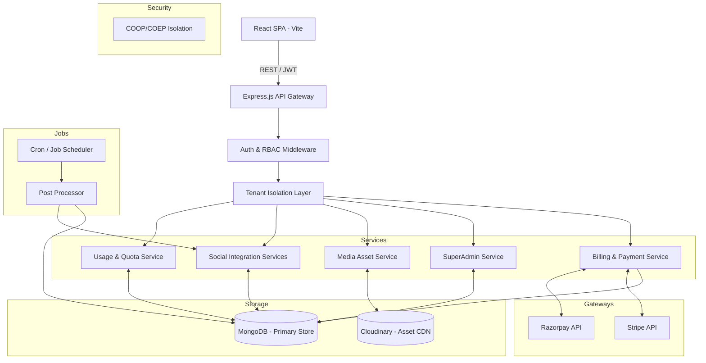

# Platform Architecture - Auto Posting

This document outlines the technical architecture, data flow, and design patterns used in the Auto Posting platform.

---

## 🏗️ High-Level System Architecture


```mermaid
graph TD
    Client[React SPA - Vite]
    API[Express.js API Gateway]
    Auth[Auth & RBAC Middleware]
    Tenant[Tenant Isolation Layer]
    
    subgraph Services
        UsageSvc[Usage & Quota Service]
        SocialSvc[Social Integration Services]
        MediaSvc[Media Asset Service]
        AdminSvc[SuperAdmin Service]
        BillingSvc[Billing & Payment Service]
    end

    subgraph Gateways
        Razorpay[Razorpay API]
        Stripe[Stripe API]
    end

    subgraph Security
        Headers[COOP/COEP Isolation]
    end
    
    subgraph Storage
        DB[(MongoDB - Primary Store)]
        CDN[(Cloudinary - Asset CDN)]
    end
    
    subgraph Jobs
        Scheduler[Cron / Job Scheduler]
        Processor[Post Processor]
    end

    Client -->|REST / JWT| API
    API --> Auth
    Auth --> Tenant
    Tenant --> UsageSvc
    Tenant --> SocialSvc
    Tenant --> MediaSvc
    Tenant --> AdminSvc
    Tenant --> BillingSvc
    
    BillingSvc <--> Razorpay
    BillingSvc <--> Stripe
    BillingSvc --> DB
    
    UsageSvc <--> DB
    SocialSvc <--> DB
    MediaSvc <--> CDN
    AdminSvc <--> DB
    
    Scheduler --> Processor
    Processor --> SocialSvc
    Processor --> DB
```

---

## 🔐 Security & Identity Model

### 1. Multi-Tenancy (Data Isolation)
The platform uses a **Shared Database, Isolated Documents** approach. Every sensitive entity (Users, Posts, Media, Accounts) is strictly bound to an `organizationId`.
- **Middleware Enforcement**: The `tenantMiddleware` ensures that any request coming from an organization admin or user is automatically scoped to their `organizationId`.
- **SuperAdmin Bypass**: Global administrators can bypass these filters to perform platform-wide maintenance.

### 2. Authentication Flow
- **JWT Strategy**: Short-lived `accessToken` (HTTP-only / Header) and a persistent `refreshToken` stored securely in the database.
- **Token Encryption**: Social media access tokens (YouTube, etc.) are encrypted at rest using **AES-256-CBC** before being stored in the database.
- **Cross-Origin Isolation**: To enable high-performance client-side media processing (FFmpeg.wasm), the server enforces **COOP (same-origin)** and **COEP (require-corp)** headers. This allows `SharedArrayBuffer` usage while maintaining a secure sandbox.

---

## 💳 Billing & Payment Architecture

The platform implements a robust subscription engine supporting multiple payment gateways:

### 1. Gateway Orchestration
- **Razorpay Service**: Handles INR payments, order creation, and signature verification.
- **Stripe Service**: Manages international payments and webhook processing for asynchronous event handling (e.g., subscription renewals).
- **Billing Service**: A centralized service that manages plan transitions, quota synchronization, and side-effects of successful payments.

### 2. Automated Invoicing
- **PDF Generation**: Uses a specialized utility to generate professional invoices upon successful payment.
- **Mail Integration**: Invoices are automatically dispatched to organization admins via `MailService`.
- **Audit Trails**: All financial transactions are recorded in the `Invoices` collection and logged in the `AuditLog`.

---

## ⚡ Core Workflows

### 1. Post Scheduling & Publishing
1. **Creation**: User creates a post; the API validates the organization's monthly post quota via `UsageService`.
2. **Scheduling**: Post is stored with `status: scheduled` and a target `scheduledAt` timestamp.
3. **Processing**: A cron-based background job identifies pending posts.
4. **Locking**: Uses MongoDB `findOneAndUpdate` to atomically mark a post as `processing`, preventing duplicate publishing in horizontal scaling scenarios.
5. **Execution**: The `PostProcessor` routes the content to the appropriate social service (YouTube, Meta, etc.).
6. **Result**: Upon success/failure, the audit log is updated, and the organization's usage counter is incremented.

### 2. Media Management
- **Upload**: Directly proxied to Cloudinary or uploaded via server-side buffers.
- **Metadata**: Image/Video metadata (size, resolution, duration) is stored locally for quota enforcement.
- **Client-Side Editing**: 
    - **Images**: Uses Fabric.js to manipulate canvas elements directly in the browser.
    - **Videos**: Uses FFmpeg.wasm (WebAssembly) to trim videos client-side, reducing server CPU load and avoiding massive file transfers for simple edits.

---

## 📊 Resource Management (Quotas)

The platform implements a tiered **Resource Authority** system with the following default plans:

| Feature | Free | Professional | Enterprise |
|---------|------|--------------|------------|
| Monthly Posts | 10 | 100 | 5,000 |
| Social Accounts | 3 | 10 | 50 |
| Storage | 500MB | 10GB | 100GB |
| Team Members | 1 | 5 | 20 |
| YouTube Quota | 5,000 | 20,000 | 100,000 |

- **Usage Model**: A dedicated collection tracks real-time consumption (`postsUsed`, `platformsUsed`, `storageUsedBytes`).
- **Plan Synchronization**: When an organization upgrades, the `syncOrganizationQuotas` method atomically updates both the `Organization` document and the active `Usage` record.

---

## 📁 Key Directories

```text
server/src/
├── controllers/    # Request orchestration & Validation
├── models/         # Mongoose Schemas (The "Source of Truth")
├── services/       # Business logic (Billing, Social, Quotas)
├── middlewares/    # Security, Tenant Isolation, File Uploads
└── utils/          # Encryption, Invoice Generation, PDF Logic

client/src/
├── features/       # RTK Query API & Redux State
├── components/     # Atomic UI components
└── pages/          # Layouts and Route-level views
```

---

## 📈 Scalability Considerations
- **Stateless API**: The backend is designed to be stateless, allowing for horizontal scaling.
- **Idempotency**: Atomic operations on `Usage` and `Post` collections prevent race conditions in multi-instance environments.
- **CDN Offloading**: All heavy media assets are served via Cloudinary.
